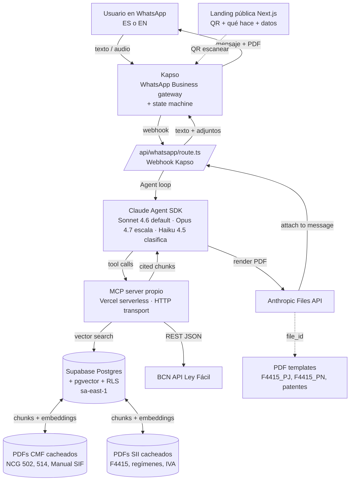

# ARCHITECTURE.md — System Design

> Living architecture doc. Update when components change. Diagram first, prose second.

**Producto canónico:** Chispla es un agente conversacional **solo WhatsApp** (vía Kapso) para microemprendedores formalizando empresa por primera vez en Chile. Wow moment: PDFs pre-rellenados (formularios SII y patente municipal) entregados via Files API.

---

## High-level diagram

---

## Components

### 1. Landing pública (Next.js)
- **Owner:** Edo
- **Stack:** Next.js 16 App Router · Tailwind · shadcn/ui
- **Responsabilidades:** página pública con QR para iniciar conversación en WhatsApp, explicación de qué responde Chispla, lista de datos oficiales que consume (CMF, SII, BCN, SERNAC), disclaimers legales, créditos del equipo.
- **No es:** UI conversacional para usuarios. Los usuarios hablan SOLO por WhatsApp.
- **Deploy:** Vercel.

### 2. Kapso (canal WhatsApp)
- **Owner:** Edo
- **Project ID:** `3940198a-9a4c-4b25-9323-ad327ad95236` (ya creado, número WhatsApp Business asignado)
- **Responsabilidades:** ingesta de mensajes WhatsApp, envío de respuestas, adjuntos (PDFs vía Files API), state machine de la conversación (onboarding, branching, recolección de campos).
- **Lo que NO hace:** razonamiento. Cualquier decisión sustantiva pasa por Claude.

### 3. Backend Vercel (webhook + agent loop)
- **Owner:** Edo
- **Live at:** `app/app/api/whatsapp/route.ts`
- **Stack:** Next.js API route · Node.js runtime
- **Responsabilidades:** recibe webhook Kapso, valida firma, normaliza mensaje, invoca Agent SDK, devuelve respuesta a Kapso (opcionalmente con file_id de Files API).
- **Time budget por respuesta:** target <30s end-to-end (sub-check J3.3).

### 4. Agent layer (Claude Agent SDK)
- **Owner:** Lucas + Edo
- **Stack:** `@anthropic-ai/claude-agent-sdk` · prompt caching activo · streaming opcional (no es crítico en WhatsApp por la naturaleza del canal).
- **Modelos:**
  - `claude-sonnet-4-6` — default
  - `claude-opus-4-7` — razonamiento complejo (régimen tributario, escenarios cruzados SII+CMF)
  - `claude-haiku-4-5` — clasificación rápida del primer mensaje (detección de perfil) y guardrails post-respuesta
- **System prompt:** prefijo cacheado con el bloque de contexto regulatorio + sufijo dinámico con el perfil detectado y el idioma.

### 5. MCP server (corazón técnico)
- **Owner:** Lucas
- **Stack:** TypeScript · `@modelcontextprotocol/sdk` · deploy en Vercel serverless con HTTP transport.
- **Tools expuestas:**
  - `search_normativa({ query, source?, profile?, lang? })` → vector search sobre CMF/SII/SERNAC + chunks citados
  - `get_ley_facil({ law_id })` → proxy a BCN Ley Fácil API
  - `get_pasos_formalizacion({ tipo_negocio, ciudadania, comuna })` → checklist estructurado de pasos cruzados SII + municipio + CMF cuando aplica
  - `verify_citation({ url, claimed_text })` → fetch URL oficial, confirma que el pasaje citado existe (anti-alucinación)
- **Open-source post-Lab** como "MCP Ciudadano" — la apuesta que Clay propuso en su workshop.

### 6. Database (Supabase)
- **Owner:** Lucas
- **Region:** sa-east-1 (São Paulo) por latencia desde Chile
- **Schema:**
  - `regulations` — id, source, doc_type, identifier, title, url, full_text, language, published_at, scraped_at
  - `regulation_chunks` — id, regulation_id, chunk_index, chunk_text, section, embedding (vector(1536))
  - `users` — id, phone (cifrado pgcrypto), profile_type, language_pref, consent_given_at
  - `chat_sessions` — id, user_id, started_at, last_message_at
  - `messages` — id, session_id, role, content, citations (jsonb), pdf_file_ids (jsonb), created_at
  - `pdf_deliveries` — id, session_id, template, fields (jsonb), file_id, sent_at
- **Embeddings:** OpenAI `text-embedding-3-small` (1536 dims).
- **RLS:** estricto — un usuario solo ve sus propios mensajes y deliveries.
- **PII:** RUT y phone cifrados con pgcrypto. Retención TTL 90 días. Consentimiento explícito en el primer mensaje.

### 7. Data ingestion
- **Owner:** Lucas
- **Pipeline:**
  1. Firecrawl scrape sobre URLs target (`docs/DATASETS.md`)
  2. Chunker corta a ~500 tokens preservando límites de artículo
  3. OpenAI embeddings → upsert a Supabase
  4. Job manual el primer día (6-may), después cron diario.

### 8. PDF templates + Files API (wow moment)
- **Owner:** Edo (integración Files API) · Luca + Lucas (mapeo de campos a llenar en cada formulario).
- **Templates oficiales descargados al repo (`app/templates/pdfs/`):**
  - `F4415_PJ.pdf` — SII inicio actividades persona jurídica (`https://www.sii.cl/formularios/imagen/F4415_PJ.pdf`)
  - `F4415_PN.pdf` — SII inicio actividades persona natural (`https://www.sii.cl/formularios/imagen/F4415_PN.pdf`)
  - `patente_providencia_F-A1.pdf` — Solicitud patente comercial e industrial autocompletable (`https://providencia.cl/provi/site/docs/20191017/20191017122917/solicitud_de_patente_comercial_e_industrial_01_01_2020_autocompletable.pdf`)
  - `patente_santiago_R-91.pdf` — Nueva patente Santiago (`https://www.santiagoenlinea.cl/wp-content/uploads/2014/05/R-91-FORMULARIO-NUEVA-PATENTE-2017-V1-3.pdf`)
- **Flujo:** Claude detecta que el usuario necesita un formulario → genera el JSON con los campos rellenados desde la conversación → backend llena el PDF con `pdf-lib` → upload a Anthropic Files API → file_id va en la respuesta a Kapso → Kapso lo adjunta al mensaje WhatsApp.
- **Disclaimer obligatorio en cada PDF entregado:** "Borrador no oficial. Verifica en SII / municipio antes de presentar. No es asesoría legal."
- **Nota legal:** desde Ley 21.210, el inicio de actividades en SII se hace por internet por defecto. El PDF sirve como **checklist visual de qué información tener lista antes** y como respaldo para casos de excepción / personas que llenan en papel. Las patentes municipales sí se siguen presentando vía formulario PDF en muchas comunas.

---

## Data flow para una consulta única

1. Usuario envía mensaje WhatsApp → Kapso lo recibe
2. Kapso dispara webhook a `app/api/whatsapp` con `{ from, body, mediaUrl?, locale? }`
3. Backend valida firma Kapso, busca/crea `users` + `chat_sessions` en Supabase
4. Si es el primer mensaje de la sesión: enviar disclaimer + pedir consentimiento explícito (PII)
5. Backend llama Agent SDK con:
   - System prompt cacheado + perfil detectado (Haiku 4.5 clasifica si es "abrir empresa", "ya estoy vendiendo informal", "extranjero residente", "reclamo financiero")
   - Tools: las del MCP
   - Modelo: Sonnet 4.6 default; Opus 4.7 si el clasificador marca alta complejidad
6. Agent loop:
   - Claude lee la consulta, decide qué tool llamar
   - MCP ejecuta vector search o llama BCN Ley Fácil
   - Claude lee resultados, decide si más tool calls o responder
   - Claude genera respuesta con citas inline (URL en cada cita) + flag opcional `should_deliver_pdf` con `{template, fields}`
7. Backend envía respuesta a Kapso. Si hay PDF: rellena con pdf-lib, sube a Files API, adjunta `file_id`.
8. Kapso entrega texto + adjuntos al usuario en WhatsApp.

---

## Public landing — qué muestra

- Hero: "Te ayudamos a abrir tu empresa en Chile sin ser abogado"
- QR + número WhatsApp para iniciar conversación
- Tres ejemplos de conversaciones (las 3 del dashboard: Luca italiano, vendedora Instagram, almacén de barrio)
- Lista de datos oficiales que consume (CMF, SII, BCN, SERNAC) con links inline
- Quién hay detrás (3 miembros + Track 01 Impact Lab)
- Disclaimer legal: no es asesoría legal ni tributaria

---

## Security & secrets

- `ANTHROPIC_API_KEY` — Vercel env var, nunca en cliente
- `OPENAI_API_KEY` — Vercel env var, solo en pipeline de ingest
- `SUPABASE_SERVICE_ROLE_KEY` — server only, nunca expuesta
- `SUPABASE_ANON_KEY` — pública con RLS estricto detrás
- `KAPSO_WEBHOOK_SECRET` — validación HMAC del webhook
- `KAPSO_API_KEY` — para enviar mensajes de vuelta
- `FIRECRAWL_API_KEY` — solo en ingest job

---

## Lo que explícitamente NO construimos

- **Lovable** — descartado por el equipo. La landing y todo el código se hacen directo en Next.js + Tailwind + shadcn.
- **Google Calendar export** — fuera de la spec final. El wow es PDFs pre-rellenados, no fechas en calendario.
- **Web chat UI para usuarios finales** — los usuarios viven en WhatsApp. La landing es solo informativa + QR.
- **Multi-persona dropdown como demo** — el switch de perfil pasa implícito por detección del primer mensaje, no por UI.
- **Auth fuera del flujo WhatsApp** — el número de teléfono es la identidad. No magic links, no SSO.
- **Mobile app** — innecesaria.
- **Voice mode** — fuera de scope.
- **Payments** — esto es impacto, no comercio.

---

**Última actualización:** 2026-05-06 — Edo — full rewrite alineando a CLAUDE.md (WhatsApp + Files API). Sustituye la versión pre-rebrand que mencionaba Lovable + Calendar.
