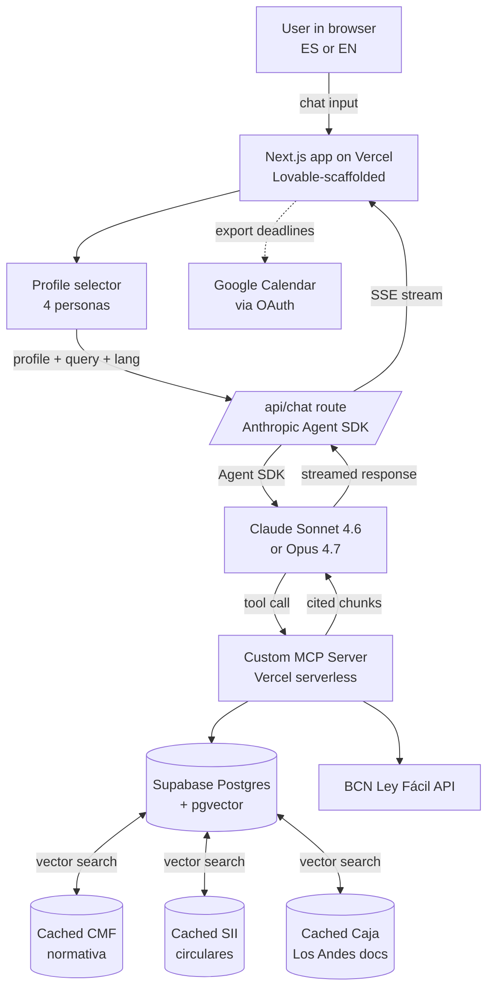

# ARCHITECTURE.md — System Design

> Living architecture doc. Update when components change. Diagram first, prose second.

---

## High-level diagram

---

## Components

### 1. Frontend (Next.js + Lovable)
- **Owner:** Edo
- **Stack:** Next.js 15 App Router, Tailwind, shadcn/ui, Lovable for scaffold
- **Responsibilities:** chat UI, profile selector, language toggle, citation rendering, Calendar export button
- **Deploy:** Vercel

### 2. Agent layer (Anthropic Agent SDK)
- **Owner:** Lucas (with Edo on integration)
- **Lives at:** `/app/api/chat/route.ts`
- **Stack:** `@anthropic-ai/claude-agent-sdk`, prompt caching enabled, streaming
- **Models:** Sonnet 4.6 default; Opus 4.7 escalation for complex profile reasoning
- **System prompt:** built dynamically from profile + language; cached prefix for the regulatory context block

### 3. MCP server (the heart)
- **Owner:** Lucas
- **Stack:** TypeScript, `@modelcontextprotocol/sdk`, deployed as Vercel serverless function with HTTP transport
- **Tools exposed:**
  - `search_normativa(query, source, profile)` — vector search over CMF/SII/Caja Los Andes
  - `get_ley_facil(law_id)` — proxy to BCN Ley Fácil API
  - `get_deadlines(situation)` — structured deadline extraction for Calendar export
  - `verify_citation(url)` — fetches the source URL and confirms the cited passage exists
- **Open-sourced after Lab** as part of the "citizen MCP" thesis

### 4. Database (Supabase)
- **Owner:** Lucas
- **Schema:**
  - `regulations` — id, source, title, url, full_text, scraped_at
  - `regulation_chunks` — id, regulation_id, chunk_text, embedding (vector(1536)), section
  - `users` — id, email, profile_type, language_pref
  - `chat_sessions` — id, user_id, profile_used, started_at
  - `messages` — id, session_id, role, content, citations (jsonb), created_at
- **Embeddings:** OpenAI text-embedding-3-small (1536 dims)

### 5. Data ingestion
- **Owner:** Lucas
- **Pipeline:**
  1. Firecrawl scrapes target URLs → clean Markdown
  2. Chunker splits at ~500 tokens, preserving article boundaries
  3. OpenAI embeddings → upsert to Supabase
  4. One-time job Tuesday night, then nightly cron during the Lab

### 6. Calendar export
- **Owner:** Edo
- **Flow:**
  1. Agent response includes structured `deadlines: [{ title, date, source_url }]`
  2. UI renders "Exportar a Google Calendar" button
  3. Click → OAuth (if not already) → Google Calendar API batch insert
  4. Confirmation: "5 fechas agregadas a tu calendario"

---

## Data flow for a single query

1. User picks profile + types query in UI
2. UI POSTs `{ profile, query, language, sessionId }` to `/api/chat`
3. API route initializes Agent SDK with:
   - System prompt (cached prefix + profile-specific suffix)
   - Tools: the MCP tools
   - Model: Sonnet 4.6 (or Opus 4.7 if `complexity === 'high'`)
4. Agent loop:
   - Claude reads query, decides which MCP tool to call
   - MCP tool executes (vector search or Ley Fácil API)
   - Claude reads results, decides if more tool calls needed
   - Claude generates final response with inline citations
5. API streams response to UI via SSE
6. UI renders, with citations as clickable cards
7. If deadlines were detected, "Export to Calendar" button appears

---

## Security & secrets

- `ANTHROPIC_API_KEY` — Vercel env var, never in client code
- `OPENAI_API_KEY` — Vercel env var, only used by ingest job (not request path)
- `SUPABASE_SERVICE_ROLE_KEY` — server-only, never exposed
- `SUPABASE_ANON_KEY` — public, RLS enforced
- `FIRECRAWL_API_KEY` — only used by ingest job
- Google OAuth — Edo configures, redirect URIs set for `localhost` + Vercel preview + production

---

## What we're explicitly NOT building

- Authentication beyond magic-link (no SSO, no OAuth providers besides Google for Calendar)
- Mobile app (web responsive only)
- Voice mode (unless we ship everything else by Wed night and have time)
- Payments (this is impact, not commerce)
- Analytics dashboard for org users (out of scope for demo)

---

**Last updated:** 2026-05-05 — Luca — initial draft
